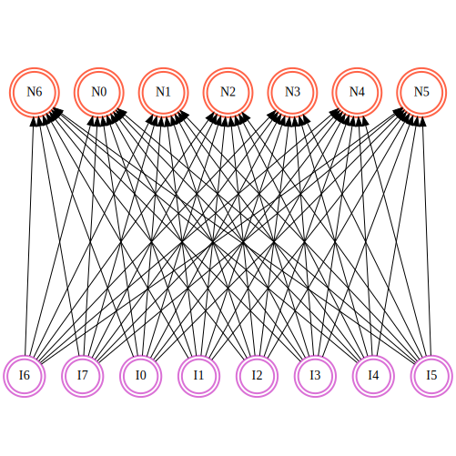
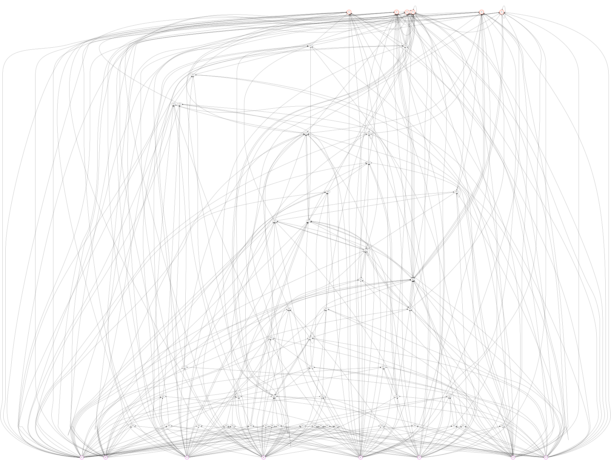

# fluffy-penguin

Implementation of the ENT2 genetic algorithm in Rust, because both are awesome =]

[Here](https://towardsdatascience.com/neat-an-awesome-approach-to-neuroevolution-3eca5cc7930f) you can find a good article about the algorithm that inspired EANT2.

[](https://travis-ci.com/dymayday/fluffy-penguin)

- [fluffy-penguin](#fluffy-penguin)
  - [About](#about)
  - [Requirements](#requirements)
  - [Usage](#usage)
  - [Visualisation](#visualisation)
  - [Examples](#examples)
  - [TODO](#todo)

## About

This library use Evolutionary algorithms ([EA](https://en.wikipedia.org/wiki/Evolutionary_algorithm)) to automatically evolve the topology of the artificial neural networks of each individual in a population.

> Evolutionary Algorithms belong to the Evolutionary Computation field of study concerned with computational methods inspired by the process and mechanisms of biological evolution. The process of evolution by means of natural selection (descent with modification) was proposed by Darwin to account for the variety of life and its suitability (adaptive fit) for its environment. The mechanisms of evolution describe how evolution actually takes place through the modification and propagation of genetic material (proteins). Evolutionary Algorithms are concerned with investigating computational systems that resemble simplified versions of the processes and mechanisms of evolution toward achieving the effects of these processes and mechanisms, namely the development of adaptive systems. Additional subject areas that fall within the realm of Evolutionary Computation are algorithms that seek to exploit the properties from the related fields of Population Genetics, Population Ecology, Coevolutionary Biology, and Developmental Biology.
> -- <cite>[cleveralgorithms.com](http://www.cleveralgorithms.com/nature-inspired/evolution.html)</cite>

Artificial neural networks are characterized by their _structure_ (_topology_) and their parameters (which includes the weights of connections). When an ANN is to be developed for a given problem, two aspects need therefore to be considered:

- What should be the structure (or, topology) of the network?
- Given the structure of the neural network, what are the optimal values for its _parameters_?

*EANT2*, _Evolutionary Acquisition of Neural Topologies_, is an evolutionary reinforcement learning  system that is suitable for learning and adapting to the environment through interaction. It combines the principles of neural networks, reinforcement learning and evolutionary methods.

## Requirements

- Rust compiler: See https://www.rust-lang.org or https://doc.rust-lang.org/book/second-edition/ch01-01-installation.html
- [Graphviz](http://www.graphviz.org/): used to export to SVG the rendered artificial neural networks.

## Usage

Because this crate is still a work in progress, it's not yet published on [crates.io](https://crates.io/) so you need to add this to your `Cargo.toml`:

```toml
[dependencies]
fluffy-penguin = { git = "https://github.com/dymayday/fluffy-penguin.git" }
```

Initializing the algorithm is simple:
```rust
extern crate fluffy_penguin;
use fluffy_penguin::genetic_algorithm::Population;

let population_size: usize = 16;
let input_size: usize = 8;
let output_size: usize = 9;
let mutation_probability: f32 = 0.05;

let mut population: Population<f32> = Population::new(
    population_size,
    input_size,
    output_size,
    mutation_probability,
);

let cycle_per_structure = 100;

loop {
    // You need to have some inputs to feed the ANNs with, and so evaluate the model base on this inputs.
    let scores: Vec<f32> = population
        .species
        .iter()
        .map(|specimen| compute_specimen_score(specimen))
        .collect();

    // The score/fitness function is let to the user to implement, you only need to attribute the value to each individual when its computed.
    // Update fitness of each specimen.
    // High score needs to represent a better fitness.
    for (specimen, score) in population.species.iter_mut().zip(&scores) {
        specimen.fitness = -score;
    }

    // You need to manually trigger the exploration (structural mutation) and exploitation (weights and connections optimization) phases
    if population.generation_counter % cycle_per_structure == 0 {
        population.exploration();
    } else {
        population.exploitation();
    }

    // And trigger the evolution process
    population.evolve();
}

```

The *score/fitness* function is the representation of 'how well an _individual_ performs' in a population for the defined problem. A high value means a high fit.

## Visualisation

You can visualize the structure and the parameters of the ANNs by calling the `render()` method on a Population/Individual instance:

```rust
let population_size: usize = 8;
let input_size: usize = 8;
let output_size: usize = 9;
let mutation_probability: f32 = 0.05;

let mut population: Population<f32> = Population::new(
    population_size,
    input_size,
    output_size,
    mutation_probability,
);

let viz_dir = "tmp/basic/";
let print_jumper = false; // Keep it false for a better visual experience
let print_weights = false; // Can increase the rendering time to SVG by a lot
population.render(viz_dir, print_jumper, print_weights);
```

And this should give you the representation of each individual in the population close to something like this before any mutation/neuro-evolution:



And something marvellous like this after quite a few generations:



## Examples

You can run a simple math equation fitting by running:

```bash
cargo run --example basic --release
```

The MNIST example is still a work in progress at the moment and need some serious work on the score/fitness algorithm, but you can still run it with:

```bash
cargo run --example mnist --release
```

## TODO

- [ ] Implement CMA-ES (Covariance Matrix Adaptation - Evolution Strategy) and its multi-objective optimization (MO-CMA-ES).
- [ ] Add advanced scoring methods (looking into python's scikit-learn library might be a good start).
- [ ] Implement the EANT2 pruning method of unnecessary connections during neuro-evolution.
- [ ] Improve API documentation.
- [X] Limit the number of concurrent renderer process and put it in a non blocking thread.
- [ ] Fix dependencies versions when hitting first beta.
